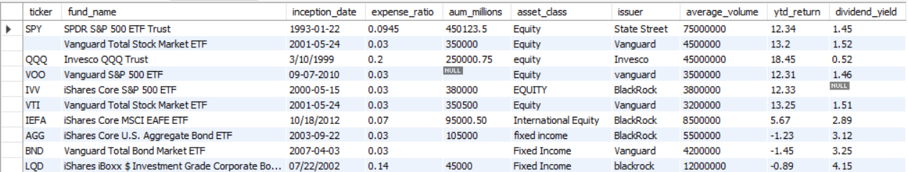

# Clean a dirty ETF dataset with SQL

This repository contains a SQL data cleaning project using MySQL 8.0. 

The project involves cleaning a deliberately "dirty" ETF (Exchange-Traded Fund) dataset that contains common data quality issues like duplicates, inconsistent formatting, and missing values found in real-world scenarios. 


## Process

A dirty dataset about ETFs was generated using Claude, and the resulting CSV file was imported into MySQL.

Let us first have a look at our data.

```
Select *
from dirty_etf_dataset
limit 10;
```

### First peek at our dirty data




## Learning Goals

- Remove duplicate records
- Standardize text formatting and casing
- Convert and standardize date formats
- Handle NULL values and empty strings
- Identify and fix text "NULL" vs actual NULL values
- Standardize categorical data

## Files in This Repository

- `dirty_etf_dataset.csv` - Original dirty dataset with data quality issues
- `etf_data_cleaning.sql` - Complete SQL script with all cleaning steps
- `README.md` - Project documentation (this file)
- `clean_etf_dataset.csv` - Cleaned output dataset

## Data Quality Issues Addressed

### 1. **Duplicate Records**
- Identified and removed duplicate entries using ROW_NUMBER() window function
- Example: VTI (Vanguard Total Stock Market ETF) appeared twice

### 2. **Inconsistent Date Formats**
- Multiple date formats: `YYYY-MM-DD`, `MM/DD/YYYY`, `M/DD/YYYY`, `MM-DD-YYYY`
- Standardized all dates to MySQL DATE format using CASE statements and STR_TO_DATE()

### 3. **Inconsistent Text Casing**
- Mixed case in categorical columns: `equity`, `Equity`, `EQUITY`
- Standardized issuer names: `BlackRock`, `blackrock`, `BLACKROCK`
- Applied consistent Title Case formatting across all categorical fields

### 4. **Text "NULL" vs Actual NULL**
- Identified text strings "NULL", "null", and "N/A" that should be actual NULL values
- Converted all fake NULL strings to proper NULL values

### 5. **Empty Strings and Whitespace**
- Found empty strings (`''`) and whitespace-only values (`'   '`)
- Used TRIM() function to detect and clean whitespace
- Converted empty/whitespace values to NULL where appropriate

### 6. **Missing Values**
- Missing ticker symbols
- Missing AUM (Assets Under Management) values
- Missing dividend yield data
- Filled in missing tickers using self-joins on fund names


## Dataset Schema

| Column | Type | Description |
|--------|------|-------------|
| ticker | TEXT | ETF ticker symbol |
| fund_name | TEXT | Full name of the fund |
| inception_date | DATE | Date fund was created |
| expense_ratio | DOUBLE | Annual fee as percentage |
| aum_millions | TEXT | Assets under management in millions |
| asset_class | TEXT | Type of assets (Equity, Fixed Income, etc.) |
| issuer | TEXT | Company managing the fund |
| average_volume | INT | Average daily trading volume |
| ytd_return | DOUBLE | Year-to-date return percentage |
| dividend_yield | TEXT | Dividend yield percentage |
